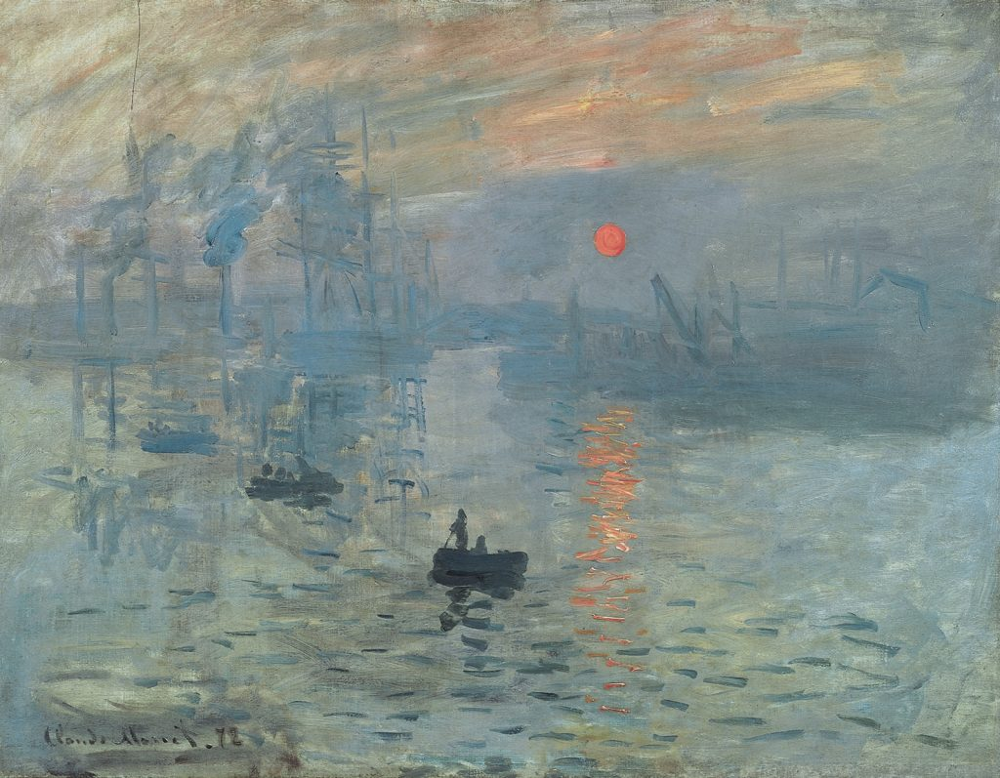

# CLIP Art Style Classification

## Project Description
The goal of this project is to develop a deep learning model that can accurately classify different styles of art and generate a text description for each piece. We will utilize and fine-tune the CLIP model, which connects texts and images and can be applied to any visual classification task.

## Problem Motivation
- Complex Visual Features: Traditional models struggle with complex art visual features.
- Lack of Text-Image Integration: CNN models can't handle image and text together, limiting semantic understanding.
- Limited Information Extraction: Image-based classification overlooks valuable text information, hindering research and museum experiences.

## Project Milestones
1. Data Preprocessing (Image Preprocessing & Text Preprocessing)
2. Train and Evaluate Baseline CNN Model
3. Fine-tune the Pretrained CLIP Model
4. Hyperparameter Tuning the CLIP Model

## Background Work
We will use the following dataset for this project:
- [European artworks dataset](https://www.kaggle.com/datasets/ansonnnnn/historic-art) from the Web Gallery of Art.
- Images of European artwork.
- CSV artwork dataset detailing art background, such as title, time period, and texture.
- CSV info dataset detailing image information, such as artist and nationality.

## Approach

1. **CNN:** Use the baseline model to do supervised learning on art style classification.
  Train and evaluate model performance on the test set.
   - Outcome: After 20 epochs of training, the CNN model achieves a test accuracy of 0.67. 
   - The model was overfitting to the training set, with a high training accuracy of 0.94. 
   - The loss increases in the last two epochs, indicating a lack of generalization and potential instability in the model's predictions.

2. **Pretrained CLIP (Contrastive Language-Image Pretraining):**
   - CLIP model: Text and image encoders encode text and image data into a shared embedding space.
   - Objective: Maximize cosine similarity of associated image-text pairs (N pairs) and minimize similarity of non-associated image-text pairs (N^2 - N pairs).
   - Architecture: Load the pre-trained CLIP model, and we choose ViT-B/32 as our architecture.
   - Better understanding of the association between text and images.
   - Computationally efficient and easier to train.
   - Strong Out-of-Distribution generalization performance (OOD).

## Implementation Details

1. Make data fit into CLIP and convert to single precision floating point.
2. Balanced batches of image-caption pairs.

## Demo

Input an image, and output would be classification "Impressionism" and text description:

- "This is an artwork from painter MONET, Claude during the period of Impressionism. The title of this painting is Sunrise, Impressionism."
